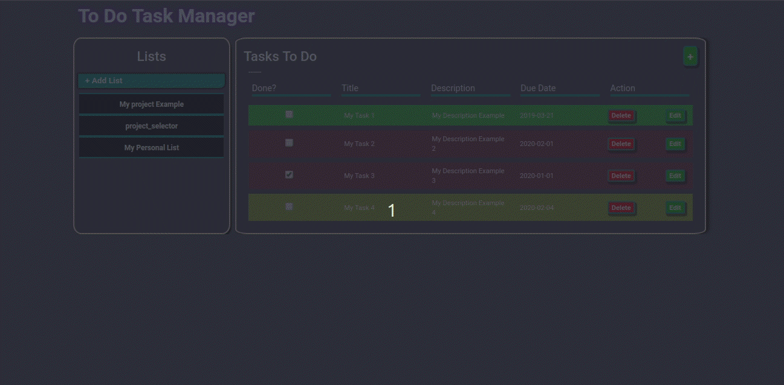

# To-Do List Project

> To-Do List project to manage your times and tasks made with JavaScript and Webpack deployed on git-hub Pages

### Desktop view



Javascript with Webpack project from [The Odin Project curriculum](https://www.theodinproject.com/courses/javascript/lessons/todo-list)

## Built With:

- Html,Css,JavaScript
- Webpack
- npm manager

## Live Demo

[Live Demo Link](https://mephistodevelop.github.io/ToDo-List/)

## Future Features

- Store data on a remote server
- Notifications reminders.

## Getting Started

### Prerequisites

-before running this project you will need to install before webpack and configure the live server on your webpack.config file. you can check more about it on this [page](https://webpack.js.org/guides/installation/).

[npm install and config: ](https://docs.npmjs.com/cli/install)

### Setup

To use this project you will need to download this repository onto your computer. Afterwards, you will need to install webpack and npm to correctly run this project. In the package.json file, input this

in `package.json` file on the rules we are going to put this:

```
 "scripts": {
 "test": "echo \"Error: no test specified\" && exit >1",
 "build": "webpack --mode production",
 "builddev": "webpack --mode development",
 "start": "webpack-dev-server --mode development >--open"
 }
```

In the `webpack.config.js` file we are going to input this config in order to use live-sync browser reloaded automatically using `npm run start`

```
const path = require('path');
const BrowserSyncPlugin = require('browser-sync-webpack-plugin');

module.exports = {
entry: './src/index.js',
output: {
filename: 'main.js',
path: path.resolve(\_\_dirname, 'dist'),
},
watch: true,
module: {
rules: [
{
test: /\.css$/,
        use: ['style-loader', 'css-loader'],
      },
      {
        test: /\.(png|svg|jpg|gif)$/,
use: ['file-loader'],
},
],
},
};

module.exports = {
watch: true,
plugins: [
new BrowserSyncPlugin({
host: 'localhost',
port: 3001,
files: [
'./dist/*.html',
'./dist/*.js',
'./dist/*.css',
'./src/*.js',
'./src/img/*.jpg',
],
server: { baseDir: ['dist'] },
}),
],
};
```


Installing Bootstrap

Use the following command to install Bootstrap and its peer dependencies, jQuery and Popper:

`$>npm install bootstrap jquery popper.js --save`

If you choose to import Bootstrap’s JavaScript plugins individually as needed, you must also install an exports-loader.

`$> npm install exports-loader --save-dev`

You’ll need to install the required loaders and post CSS plugins for compiling and bundling Bootstrap precompiled Sass files.

`$> npm install autoprefixer css-loader node-sass postcss-loader sass-loader style-loader --save-dev`

### Deployment

To deploy the application and view it on your browser, open your project folder terminal and run these command:" ; "To run the linter files you will need to run these command on the terminal

`npm install`
`npm run build`
`npm i -D webpack-dev-server`
`npm i browser-sync --save`

`npm install eslint eslint-config-airbnb --save-dev`
`npx eslint --init`
`npx client`

After, you will need to enter to Stickler Page and activate your repository.

[Stickler Page](https://stickler-ci.com/) 

## Authors

👤 **Cristian Ines Hernandez A. - MephistoDevelop**

- Github: [@MephistoDevelop](https://github.com/MephistoDevelop)
- Twitter: [@MephistoDevelop](https://twitter.com/MephistoDevelop)
- Linkedin: [Cristian Hernandez](https://www.linkedin.com/in/cristian-hernandez1992/)

## 🤝 Contributing

Contributions, issues and feature requests are welcome!

Feel free to check the [issues page](issues/).

## Show your support

Give an ⭐️ if you like this project!

## 📝 License

This project is [MIT](lic.url) licensed.
